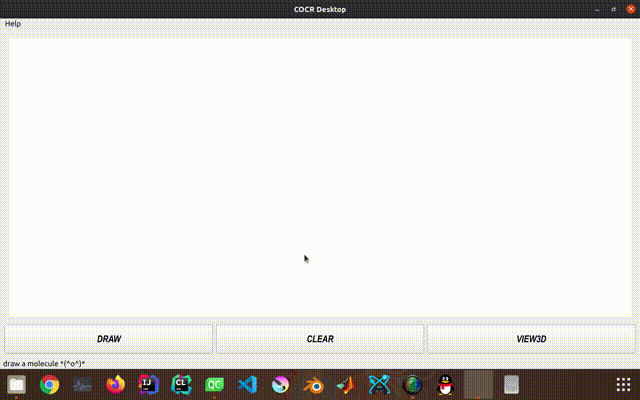

[简体中文](./README.md) | English

# COCR
* OCR system of handwritting chemical structural formulas supporting 17 kinds of items

## Features
* Get script from sketch board
* Use yolo to detect all items from image
* Use clustering method to compile a molecule graph
* Render molecule graph with Qt3D
* Export molecule graph with coordinates as chemical formats that openbabel supports

<table width="100%" border="0" cellspacing="0" cellpadding="0">
<tr>
  <td align="center"></td>
  <td align="center"></td>
  <td align="center"></td>
</tr>
<tr>
  <td align="center">Input image</td>
  <td align="center">Object detection</td>
  <td align="center">3D Rendering</td>
  </tr>
</table>

## Demo

* Support single element symbols: C、H、O、N、P、B、S、F、Cl、Br、I
* support bond types: single, double, triple, hash wedge, solid wedge, circle
* dont support string like -CH3COOH, -OEt. dont support any numbers

## Build
* Download yolo-3l.weights from Release pages and put it under src/resources/model
* For MSVC in windows
    1. Download msvc_x64_lib.7z from Release pages and extract it under COCR root like this:\
                ├── COCR.pro\
                ├── msvc_x64_lib\
                │   ├── include\
                │   └── x64
    2. Install Qt 5.15.2. There was a qt3d-bug in 5.15.1 dealing with coordinate systems under high dpi.
    3. Open COCR.pro with QtCreator, select release option, compile and run
    4. (optional) You may compile opencv4.5.0 and patched openbabel from source. You can found patched openbabel by openbabel3.1.1.7z in Release page.
* For LINUX
    1. Install Qt5.15.2 from Qt mirror
    2. Use package manager like apt-get to install openbabel (libopenbabel-dev, e.g.)
    3. Compile OpenCV>=4.5.0 from source
    4. Set MY_OPENCV_DIR in COCR.pro
    5. Open COCR.pro with QtCreator, compile and run
* For MACOS, it is possible to build, but, now that there is no touch support for mac-PC, I wont try it at present.

## License
[GPL-3.0 License](LICENSE.md)

## Thanks
* thirdparty libraries COCR desktop app use:
  1. OpenCV：https://github.com/opencv/opencv
  2. OpenBabel：https://github.com/openbabel/openbabel
  3. Qt：https://www.qt.io
* Development of COCR project was once supported by NANJING UNIVERSITY SOFTWARE INSTITUTE as a National College Student Innovation and Entrepreneurship Training Program.
