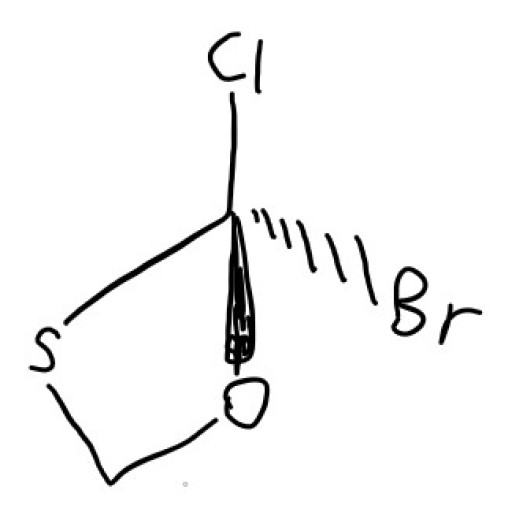
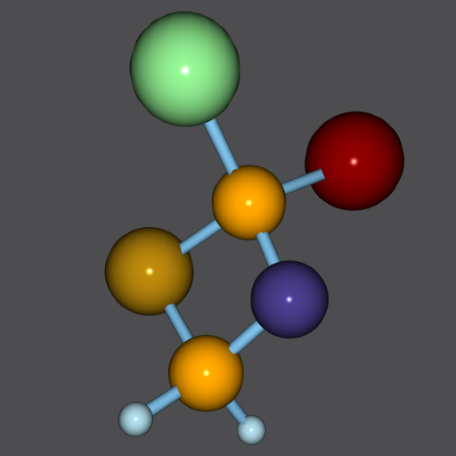

简体中文 | [English](./README-en.md)

# COCR

* 支持 17 分类的化学结构式手写图像识别系统

## 功能概述

* 前端画板获取【手写输入】
* 识别【结构式图像】为分子图，基于【目标检测技术】
* 进行带约束的【图元聚类】获取分子图
* 使用 Qt3D 渲染分子图的【球棍模型】
* 接入 OpenBabel 提供对应的所有【化学格式的导出】

<table width="100%" border="0" cellspacing="0" cellpadding="0">
<tr>
  <td align="center"></td>
  <td align="center"></td>
  <td align="center"></td>
</tr>
<tr>
  <td align="center">输入图像</td>
  <td align="center">目标检测</td>
  <td align="center">三维渲染</td>
  </tr>
</table>

## 操作示例

* 支持独立书写的元素符号 C、H、O、N、P、S、F、Cl、Br、I
* 支持的化学键包括：单键、双键、三键、实楔形键、虚楔形键、芳环中的圈
* 不支持字符串，如 -CH3COOH，-OEt，不支持任何形式的数字

## 如何构建

* 从 Release 页面下载 yolo-3l.weights 至 src/resources/model 目录

* 依赖 OpenCV >=4.5.0, Qt >=5.15.2 <6.0, OpenBabel >=2.4.

* MSVC 2019 windows
    1. 因为 MSVC 编译 OpenBabel 要踩很多坑（比如obf加载、cpp17兼容），提供 MSVC2019 x64 的预编译静态库
    2. 从 Release 页面下载 msvc_x64_lib.7z，解压到项目根目录下
    3. 目录结构形如 \
                ├── COCR.pro\
                ├── msvc_x64_lib\
                │   ├── include\
                │   └── x64
    4. 用 QtCreator 打开 COCR.pro 文件，在 Release 配置下编译即可
    5. （可选）从源码编译oencv4.5.1，从Release页面下载打过补丁的OpenBabel，文件名是 openbabel3.1.1.7z

* LINUX
    1. 使用包管理器安装 OpenBabe
    2. 下载 Qt 5.15.2
    3. 自己编译 OpenCV 4.5.0
    4. 设置 pro 文件中的 MY_OPENCV_DIR 变量指向 OpenCV 安装目录
    5. 编译运行

* 旧版本依赖库的问题
    1. OpenCV==4.4.0 无法推理模型
    2. Qt==5.15.1 的 Qt3D 模块存在 HighDpi 下坐标系错误的 Bug，这个 Bug 在 Qt==5.15.2 消失
    3. 使用旧的 Qt 版本需要在初始化 QApplication 前禁用 HighDpi

## 使用许可
[GPL-3.0 License](LICENSE.md)

## 致谢
* 客户端代码直接依赖的第三方库：
  1. OpenCV：https://github.com/opencv/opencv
  2. OpenBabel：https://github.com/openbabel/openbabel
  3. Qt：https://www.qt.io
* 南京大学本科生创新训练项目《有机物分子式自动构建系统设计与实现》，编号 202010284074Z，已结题
* 南京大学本科生创新训练项目《手写化学公式配平识别与修正》，编号 G201910284066，已结题
