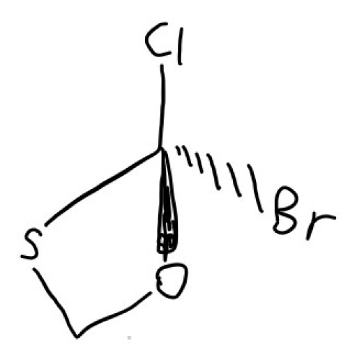
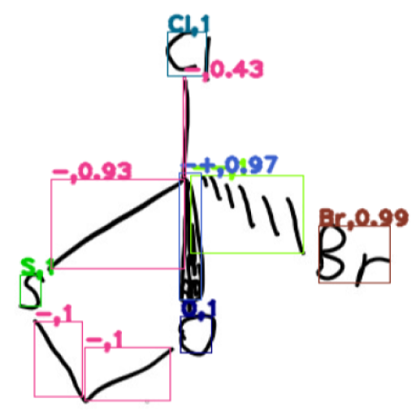
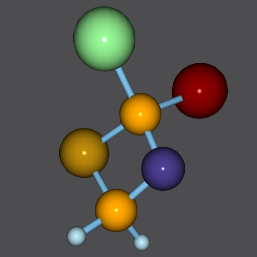

# COCR

COCR is designed to convert an image of handwriting chemical structure to graph of that molecule.

COCR, **O**ptical **C**haracter **R**ecognition for **C**hemical Structures, was once a demo for my undergraduate graduation thesis in 2021.6. It brings OCSR(optical chemical structure recognition) capability into handwriting cases.

|Symbol|String|Ring|Solid-|Hash-|Wavy-|Single-|Double-|Triple-|
|:----:|:----:|:----:|:----:|:----:|:----:|:----:|:----:|:----:|
|Appearance|**(CH<sub>2</sub>)<sub>2</sub>COOEt**|**⏣**|**▲**|**△**|**~~**|**/**|**//**|**///**|
|Status|✔️|✔️|✔️|✔️|✔️|✔️|✔️|✔️|

COCR is developed under [Qt framework](https://code.qt.io/cgit/qt/qt5.git/). It handles images with [YOLO](https://arxiv.org/abs/1506.02640) and [CRNN](https://arxiv.org/abs/1507.05717) models using [opencv](https://github.com/opencv/opencv) or [ncnn](https://github.com/Tencent/ncnn) backend.

**Online Demo**

- try on chromium-based web browser like Chrome and Edge: [https://xuguodong1999.github.io/COCR.html](https://xuguodong1999.github.io/COCR.html)

**Supported platforms:**

- [X] Windows
- [X] Android
- [X] WebAssembly
- [X] Mac OS
- [X] Linux

## News

- [2021/06] COCR v1.1 released with support for strings and wavy-bonds.

https://user-images.githubusercontent.com/40680607/160845279-a55c576e-e615-49e6-b58b-986fef86cd8f.mp4

- [2021/02] COCR v1.0 released for simple cases.

|Input|Detection|Render|
|:----:|:----:|:----:|
||||

1. Support single element symbols: C、H、O、N、P、B、S、F、Cl、Br、I.
2. Support bond types: single, double, triple, hash wedge, solid wedge, circle.

## Build

### System Requirements

1. CMake (At least 3.22), Ninja
2. Git (For submodule clone)
3. Qt 6 (Test with 6.5.2)
4. Latest C++ Compiler (Test with GCC-11.x, MSVC-v17.x, Clang-16.x)

<details>
<summary>
Qt Beginner's Guide
</summary>

* for windows developer: have 7zip, wget and git-bash ready, or simply use WSL:

```bash
# download mingw, msvc binary
wget -r -np -nH http://mirrors.nju.edu.cn/qt/online/qtsdkrepository/windows_x86/desktop/qt6_652/
# extract all 7z files to a folder called "result"
find . -name *.7z -exec 7z x {} -aos -o./result \;
```

* for linux developer:

```bash
# download gcc_64 binary
wget -r -np -nH http://mirrors.nju.edu.cn/qt/online/qtsdkrepository/linux_x64/desktop/qt6_652/
# extract all 7z files to a folder called "result"
find . -name *.7z -exec 7z x {} -aos -o./result \;
```

* for macos developer:

```bash
# download clang_64 binary
wget -r -np -nH  http://mirrors.nju.edu.cn/qt/online/qtsdkrepository/mac_x64/desktop/qt6_652/
# extract all 7z files to a folder called "result"
find . -name *.7z -exec 7z x {} -aos -o./result \;
```

after downloading and extracting, the folder structure looks like:

```txt
result/6.5.2
└── gcc_64
OR
result/6.5.2
└── msvc2019_64
OR
result/6.5.2
└── clang_64
```

Then copy `gcc_64` or `msvc2019_64` or `clang_64` to your ideal library path and it's OK.

</details>

----------


### Get the Code

```bash
git clone https://github.com/xuguodong1999/COCR.git --branch main --single-branch --recursive
```

or using ssh

```bash
git clone git@github.com:xuguodong1999/COCR.git --branch main --single-branch --recursive
```

All third-party libraries except Qt are in `third_party` directory, including [boost](https://www.boost.org/), [openbabel](https://github.com/openbabel/openbabel), [rdkit](https://github.com/rdkit/rdkit), [opencv](https://github.com/opencv/opencv), etc.

Only a minimal set of source codes is kept, and you can find custom changes in patch files under `third_party` directory.

Nearly all build scripts for third-party libraries have been rewritten, to make cross-build, bugfix and feature hack easier.

### Compile

Building COCR project is the same as common Qt 6 projects, the basic step is:

```bash
mkdir build && cd build
cmake .. -G Ninja -DCMAKE_BUILD_TYPE=Release -DBUILD_SHARED_LIBS=ON -DCMAKE_PREFIX_PATH=path/to/Qt6/binary/dir
cmake --build . --parallel --target COCR
```

for example, on linux desktop,

```bash
cmake .. -G Ninja -DCMAKE_BUILD_TYPE=Release -DBUILD_SHARED_LIBS=ON -DCMAKE_PREFIX_PATH=~/shared/Qt/6.5.2/gcc_64
```

<details>
<summary>
More custom flags to control SIMD, Release Info, etc.
</summary>

|FLAG|VALUE|USAGE|
|---|---|---|
|XGD_USE_OPENMP | ON/OFF | enable openmp, default auto-detect |
|XGD_USE_VK | ON/OFF | enable vulkan, default auto-detect |
|XGD_USE_CCACHE | ON/OFF | enable ccache, default auto-detect |
|XGD_FLAG_MARCH_NATIVE | ON/OFF | add -march=native for gcc compiler, default ON |
|XGD_FLAG_WASM_SIMD128 | ON/OFF | add -msimd128 for wasm, default ON |
|XGD_BUILD_WITH_GRADLE | ON/OFF | disable custom cmake directory layout for android studio cmake plugin, default OFF|
|XGD_OPT_RC | ON/OFF | add release info for products, default OFF |
|XGD_NO_DEBUG_CONSOLE | ON/OFF |hide debug console, default OFF |
|XGD_OPT_ARCH_X86 | ON/OFF | enable x86 specified code, default auto-detect |
|XGD_OPT_ARCH_ARM | ON/OFF | enable ARM specified code, default auto-detect |
|XGD_OPT_ARCH_MIPS | ON/OFF | enable mips specified code, default auto-detect |
|XGD_OPT_ARCH_POWER | ON/OFF | enable power pc specified code, default auto-detect |
|XGD_OPT_ARCH_32 | ON/OFF | enable 32-bit specified code, default auto-detect |
|XGD_OPT_ARCH_64 | ON/OFF | enable 64-bit specified code, default auto-detect |
|XGD_FLAG_NEON | ON/OFF | enable simd neon, default auto-detect |
|XGD_FLAG_FMA | ON/OFF | enable simd fma, default auto-detect |
|XGD_FLAG_F16C | ON/OFF | enable simd f16c, default auto-detect |
|XGD_FLAG_XOP | ON/OFF | enable simd xop, default auto-detect |
|XGD_FLAG_SSE_ALL | ON/OFF | enable simd sse/sse2/sse3/ssse3/sse41/sse42, default auto-detect |
|XGD_FLAG_AVX | ON/OFF | enable simd avx, default auto-detect |
|XGD_FLAG_AVX2 | ON/OFF | enable simd avx2, default auto-detect |

</details>

----------


### Cross-Compile

There is a typescript based cmake wrapper under [www/tools/cmake-builder](./www/tools/cmake-builder), to manage complex environment variables, toolchains, system libraries and cmake options for many cross-compile cases, including mxe, emscripten, msvc-wine, etc.

## Data

COCR uses [SCUT-COUCH2009](https://www.hcii-lab.net/data/scutcouch/CN/couch.html) as meta handwriting data, and uses QtGui::QTextDocument as rich text renderer.

A chemical structure generator for handwriting cases is written to provide training data for YOLO and CRNN models, which composes meta-character into random chemical structure formulas.

`COCRDataGen` is a gui/cli tool to display or generate training samples.

1. For GUI, directly running `COCRDataGen` will display samples through `cv::imshow`

```shell
./COCRDataGen
```

2. For CLI, add `-yolo` `[number of samples]` `[an empty, existing directory path]`, for example,

```shell
# generate 10 object detection samples under ./yolo_data/
./COCRDataGen -yolo 10 ./
```

3. For CLI, add `-crnn` `[number of samples]` `[an empty, existing directory path]`, for example,

```shell
# generate 10 text recognition samples under ./crnn_data/
./COCRDataGen -crnn 10 ./
```

4. For CLI, add `-isomer` `[number of samples]` `[an empty, existing directory path]`, for example,

```shell
# generate all alkane isomers for C-num ≤ 16 namely {CARBON_NUM}.dat under ./
# dont play with number over 20 without taking a look at src/data_gen/isomers.cpp.
# it may comsume a lot of memory and cpus.
./COCRDataGen -isomer 16 ./
```

## License

[GPLv3 Clause](./LICENSE.md)

## Citation

```bibtex
@misc{COCR2021,
  title = {COCR: Optical Character Recognition for Handwriting Chemical Structures},
  author = {xuguodong1999},
  year = {2021},
  publisher = {GitHub},
  journal = {GitHub repository},
  howpublished = {\url{https://github.com/xuguodong1999/COCR}}
}
```
