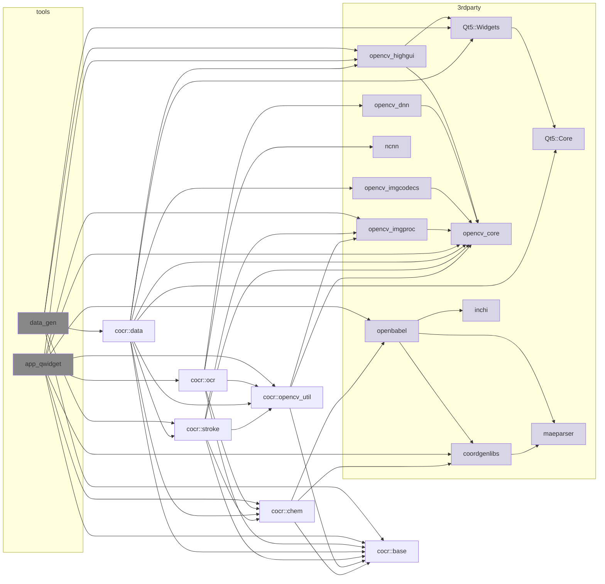

# arch chart

```mermaid
flowchart LR
  cocr::chem --> cocr::base
  cocr::chem --> openbabel:::deps
  cocr::chem --> coordgenlibs:::deps

  cocr::opencv_util --> cocr::base
  cocr::opencv_util --> opencv_core:::deps
  cocr::opencv_util --> opencv_imgproc:::deps

  cocr::stroke --> cocr::base
  cocr::stroke --> cocr::chem
  cocr::stroke --> cocr::opencv_util

  cocr::stroke --> opencv_core:::deps
  cocr::stroke --> opencv_imgproc:::deps

  cocr::data --> cocr::base
  cocr::data --> cocr::chem
  cocr::data --> cocr::stroke
  cocr::data --> cocr::opencv_util

  cocr::data --> opencv_core:::deps
  cocr::data --> opencv_imgcodecs:::deps
  cocr::data --> opencv_highgui:::deps
  cocr::data --> Qt5::Core:::deps
  cocr::data --> Qt5::Widgets:::deps

  cocr::ocr --> cocr::base
  cocr::ocr --> cocr::chem
  cocr::ocr --> cocr::opencv_util

  cocr::ocr --> ncnn:::deps
  cocr::ocr --> opencv_dnn:::deps

  app_qwidget:::app --> cocr::chem
  app_qwidget --> cocr::base
  app_qwidget --> cocr::ocr
  app_qwidget --> cocr::opencv_util
  app_qwidget --> openbabel:::deps
  app_qwidget --> coordgenlibs:::deps
  app_qwidget --> opencv_core:::deps
  app_qwidget --> opencv_imgproc:::deps
  app_qwidget --> opencv_highgui:::deps
  
  data_gen:::app --> cocr::data
  data_gen --> cocr::stroke
  data_gen --> cocr::base
  data_gen --> Qt5::Widgets:::deps
  data_gen --> opencv_highgui:::deps

  Qt5::Widgets:::deps --> Qt5::Core:::deps
  opencv_imgproc:::deps --> opencv_core:::deps
  opencv_imgcodecs:::deps --> opencv_core:::deps
  opencv_dnn:::deps --> opencv_core:::deps
  opencv_highgui:::deps --> opencv_core:::deps
  opencv_highgui:::deps --> Qt5::Widgets

  openbabel:::deps --> coordgenlibs:::deps --> maeparser:::deps
  openbabel:::deps --> maeparser:::deps
  openbabel:::deps --> inchi:::deps

  subgraph 3rdparty
    Qt5::Widgets:::deps
    Qt5::Core:::deps
    
    opencv_core:::deps
    opencv_imgproc:::deps
    opencv_imgcodecs:::deps
    opencv_dnn:::deps
    opencv_highgui:::deps
    
    maeparser:::deps
    inchi:::deps
    coordgenlibs:::deps
    openbabel:::deps
    ncnn:::deps
  end
  
  subgraph tools
    data_gen:::app
    app_qwidget:::app
  end
  
  classDef deps fill:#6d61ff44;
  classDef app fill:#888888;
```