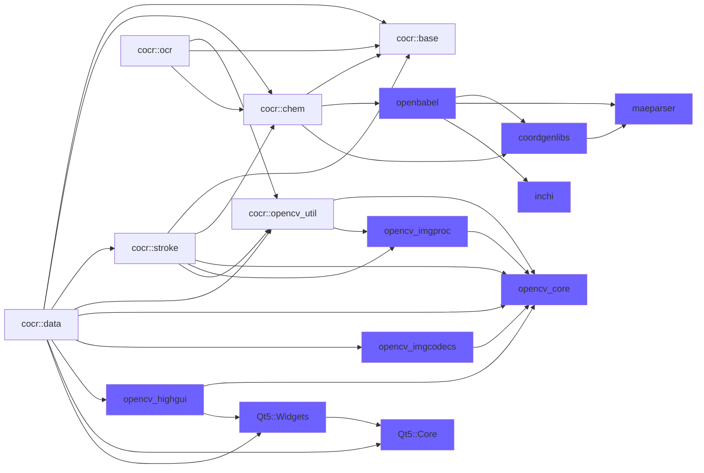

# cocr core libs

```mermaid
graph LR
    cocr::chem --> cocr::base
    cocr::chem --> openbabel
    cocr::chem --> coordgenlibs
    cocr::stroke --> cocr::base
    cocr::stroke --> cocr::chem
    cocr::stroke --> opencv_core
    cocr::stroke --> opencv_imgproc
    cocr::stroke --> cocr::opencv_util
    cocr::data --> cocr::base
    cocr::data --> cocr::chem
    cocr::data --> cocr::stroke
    cocr::data --> cocr::opencv_util
    cocr::data --> opencv_core
    cocr::data --> opencv_imgcodecs
    cocr::data --> opencv_highgui
    cocr::data --> Qt5::Core
    cocr::data --> Qt5::Widgets
    cocr::opencv_util --> opencv_core
    cocr::opencv_util --> opencv_imgproc
    cocr::ocr --> cocr::opencv_util
    cocr::ocr --> cocr::base
    cocr::ocr --> cocr::chem
    
    Qt5::Widgets:::deps --> Qt5::Core:::deps
    opencv_imgproc:::deps --> opencv_core
    opencv_imgcodecs:::deps --> opencv_core
    opencv_highgui:::deps --> opencv_core:::deps
    opencv_highgui --> Qt5::Widgets
    openbabel --> coordgenlibs
    openbabel --> maeparser
    openbabel:::deps --> inchi:::deps
    coordgenlibs:::deps --> maeparser:::deps
    classDef deps fill:#6d61ff;
```