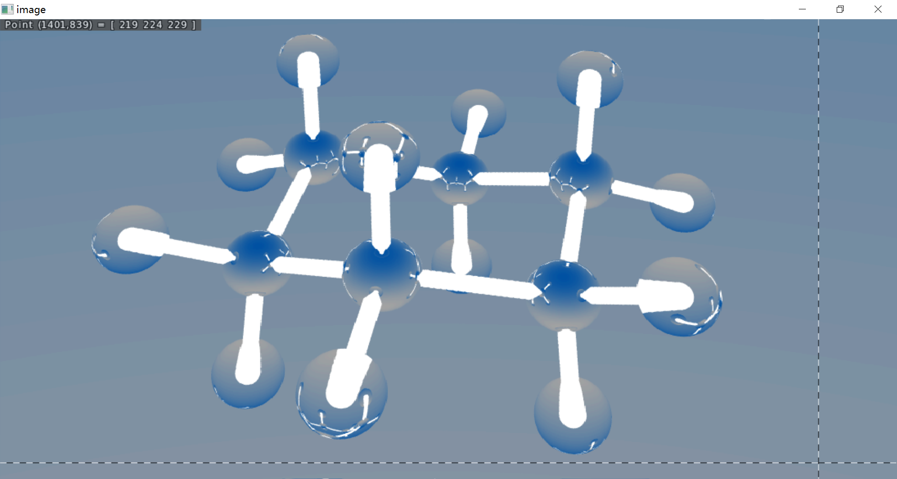
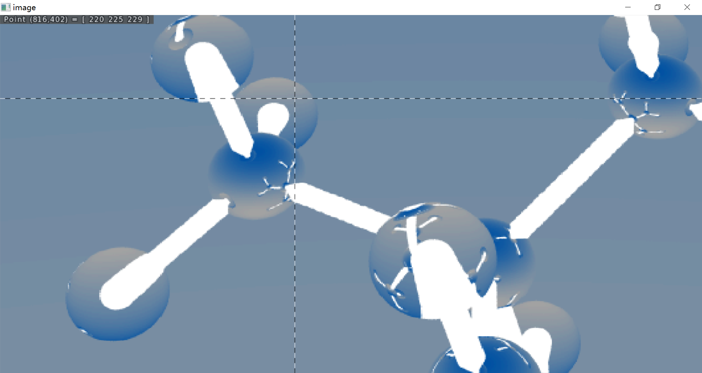

# 图形绘制技术 课程作业二 选做

## 实现的内容
* 以PBR方式渲染球棍模型
1. 粗糙面、镜面、折射面、发光表面
2. 球棍模型pdb文件的IO
3. 小球平移模拟的柱面




## 示例图像说明
1. H 原子用的是折射面
2. C 原子用反射面
3. 柱面是发光表面
4. 注意到，插入折射面球体的发光圆柱有变型
5. 注意到，靠近图片中心的球体表面有反射的骨架图像

## 编译说明
1. 使用vs，右键在vs中打开cg目录，利用vs对cmake的支持自动构建
2. 使用mingw，cg目录下，命令行:
   * md build && cd build && cmake .. -G "MinGW Makefiles" && mingw32-make -j 8

## 运行示例
```txt
C:\Users\xgd\source\repos\COCR\src\cg\build> hw2-171860633.exe

input pdb path(./C6H12.pdb, e.g.):../C8H18.pdb
```

## 备注
* 代码结构和关键算法，按照 RayTracing In OneWeekend 和 RayTracing TheNextWeek 实现的部分，包括: 
    1. Cam::collect(...)控制递归深度的方法
    2. 环境光的插值生成方式
    3. 通过接口定义曲面受光线碰撞的行为的设计模式
    4. Cloth::reflect(...)约束漫反射方向的做法
    5. 用直线的参数方程判断线面相交的做法
* 有明显问题的实现包括: 发光表面(撤掉环境光以后，无法凭发光柱面有效照亮场景)
* 用到 CImg 库显示图像