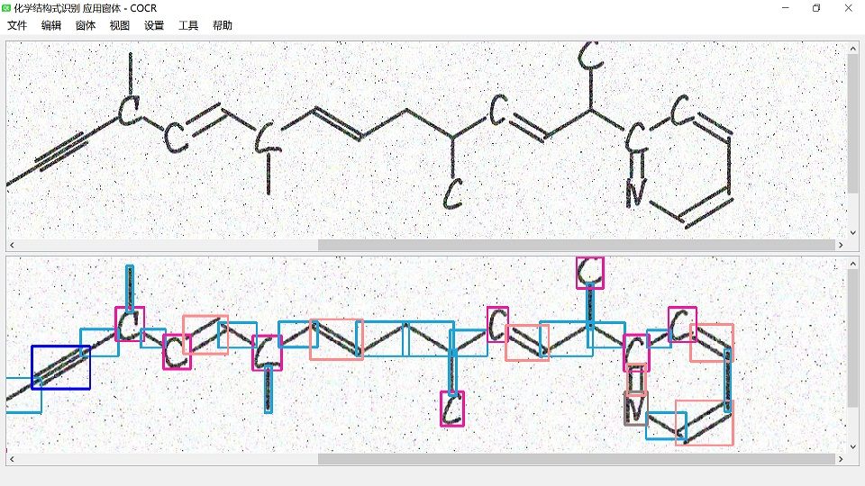

# COCR

## Apply object-detection model on OCR of structure formulas in chemistry

## Application Introduction

COCR mainly provides OCR capacity for handwritting and print-out images of structure formulas in chemistry.

## Under Development

* 2020-02-22: A demo of graphic-system comes out.
* 2020-02-17: A demo of object-detection model comes out.

## Repository Introduction

1. Current CV Model is trained over 11 classes, namely solid/dash wedge bonds, single/double/triple bonds, C, H, O, N, P, S.
2. To build the demo shown above, enter top directory in COCR, follow instructions in **【第三方库的构建】** part of  [README.md](../../README.md). 
3. You may build this project in any IDE that supports CMake. 
4. In  [CMakeLists.txt](../../CMakeLists.txt), **【add_subdirectory(version/v2020-02)】** is meant for building COCR-app-v2020-02(.exe). 

## Supplement

* No Introduction on DataSet. 
* Maybe a better DataSet can put OCR of structure formulas into pratical use 1st time in history. Who knows. 
* OSRA tried, but ten years ago, only template-based method can be used. What a wrong time birth. 
* Object-detection method seems still not to be a final solution. 
* Papers on CapsuleNet and GNN are enlightening. Who knows. 
* What's the meaning of this universe. Who knows.

